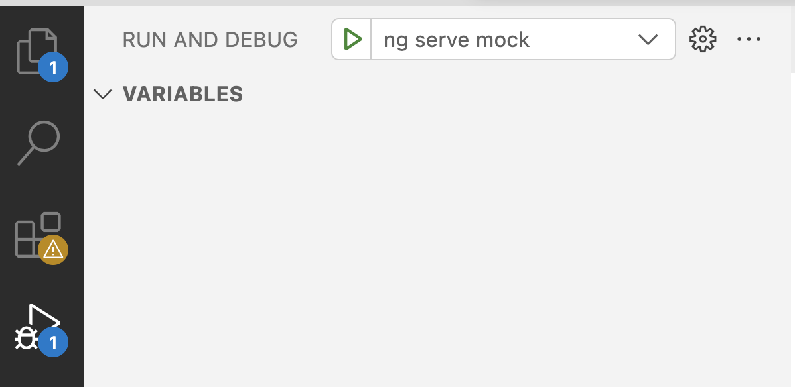
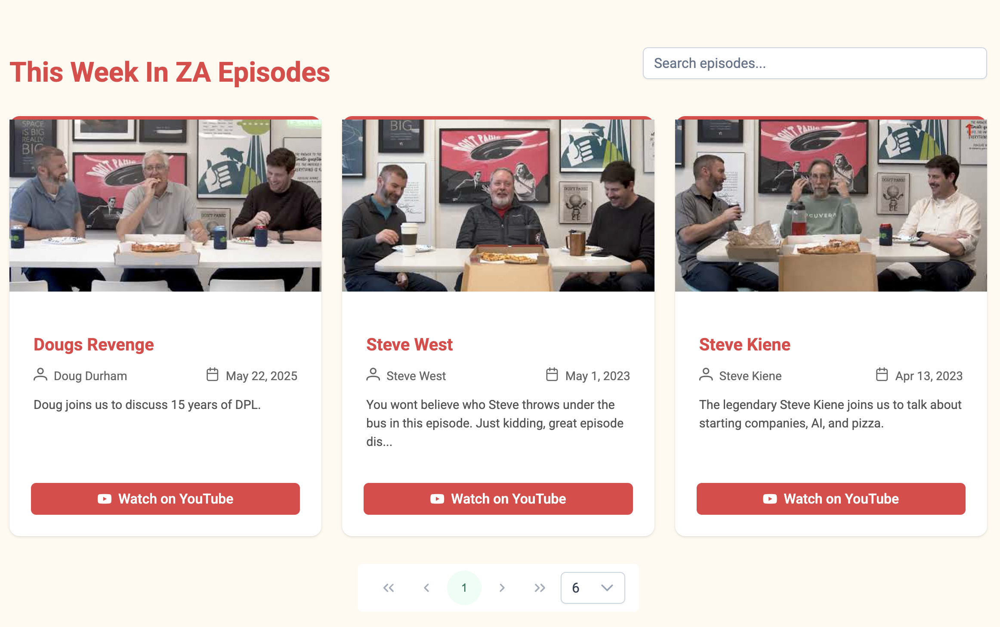

# This Week In Za - AI

## In this activity we will use a fake version of the This Week In Za to practice using AI

- Cursor
- Claude Code
- Kiro
- VS Code

## Source Overview

- Frontend: Angular
  - PrimeNG
  - In memory services

## Build/Run

Standard npm install for a frontend project.

```
npm install
```

Run in VS Code using ng server mock



# Existing Pages

## Hero page


### Episodes page



# Assignments

1. Create a homepage for this week in Za.
2. Add episode detail page.
3. Add admin page for managing episodes.
4. Add user authentication and authorization.
5. Add user profile page.
6. Add ability to chat about episodes.
